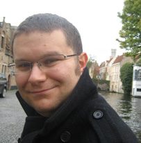

# Mark Dunning
## Bioinformatics Training Coordinator @ Cancer Research Uk Cambridge Institute

twitter: @DrMarkDunning

Mark obtained his PhD in the Statistics and Computational Biology group of [Simon Tavare](http://www.compbio.group.cam.ac.uk/) at the University of Cambridge. During this time, he developed [Bioconductor](http://www.bioconductor.org/packages/release/bioc/html/beadarray.html) packages for the analysis of [Illumina microarray data](https://www.repository.cam.ac.uk/handle/1810/218542). He then joined the [Bioinformatics Core](http://www.cruk.cam.ac.uk/core-facilities/bioinformatics-core) at Cancer Research Uk Cambridge Institute and has several years of experience working in analysing data from various high-throughput technologies and developing computational pipelines. In his current role, Mark organises and develops [Bioinformatics training courses](http://www.cruk.cam.ac.uk/core-facilities/bioinformatics-core/training).